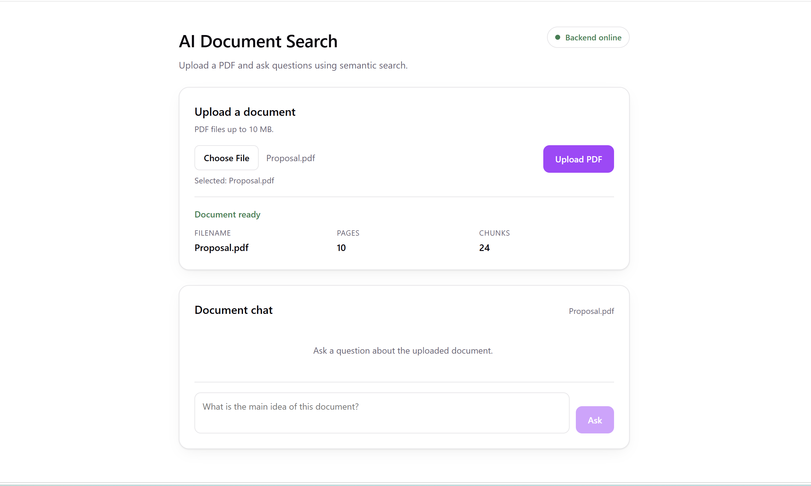
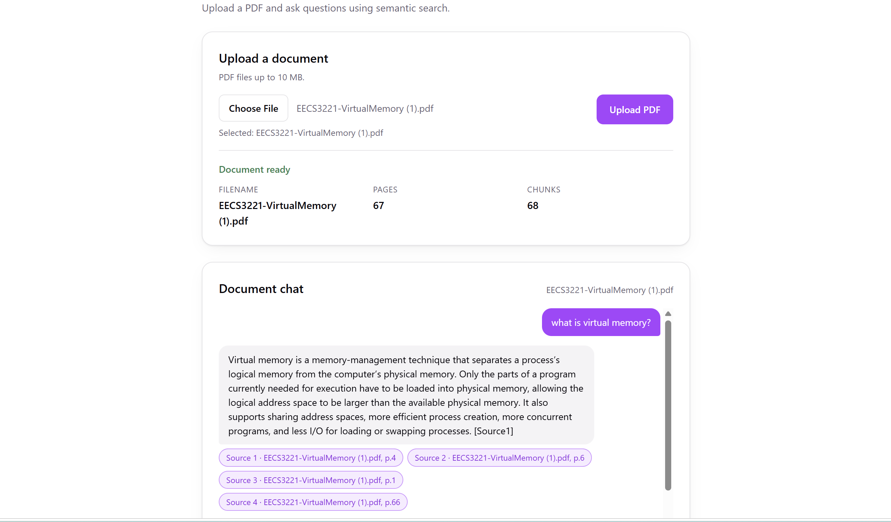
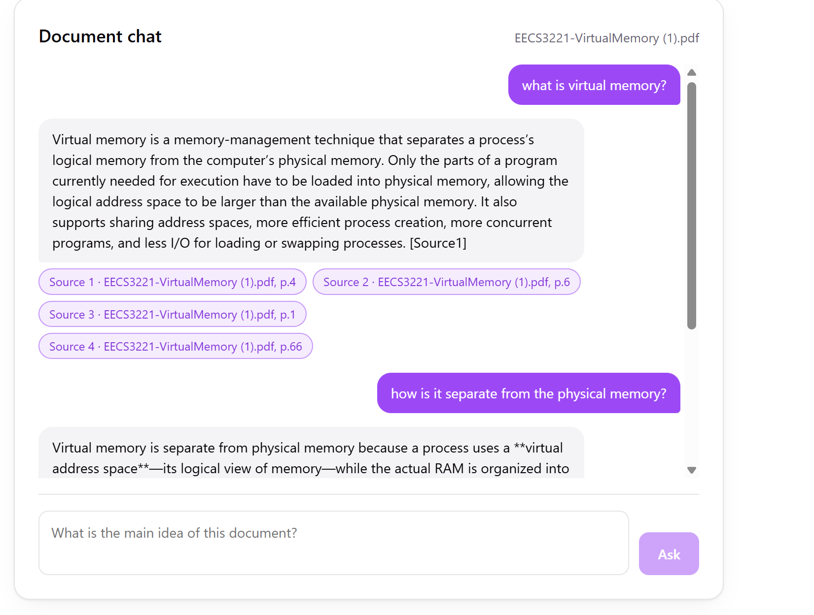

# AI Document Search

AI Document Search is a full-stack web application for exploring the contents of PDF documents through natural-language questions. Rather than requiring a reader to locate relevant passages manually, the system extracts and indexes the document text, retrieves semantically related sections, and uses a language model to compose an answer grounded in those sections.

The project is an applied example of retrieval-augmented generation (RAG). Its emphasis is not simply on producing fluent responses, but on maintaining a visible relationship between an answer and the source material from which it was derived.

## Screenshots

Uploading a PDF and reviewing the extracted page/chunk counts before asking a question:



A full session: an uploaded document with an ongoing multi-turn conversation:



Close-up of a multi-turn conversation, with each answer citing the page-level source chunks it was grounded in:



## Key features

- Upload and process PDF documents up to 10 MB.
- Extract text page by page while retaining page-level metadata.
- Divide text into overlapping chunks for more effective retrieval.
- Generate embeddings with OpenAI and store them locally in a FAISS index.
- Retrieve passages through semantic similarity search.
- Ask contextual follow-up questions using recent conversation history.
- Display the filename and page number associated with each answer source.
- Reject unsupported, empty, encrypted, or unreadable PDF files.

## How the system works

```text
PDF upload
    |
    v
Text extraction and chunking
    |
    v
OpenAI embeddings -> local FAISS index
    |
    v
User question -> semantic retrieval -> grounded model response
                                      -> page-level sources
```

When a PDF is uploaded, the backend extracts readable text with `pypdf` and divides it into overlapping chunks with LangChain. Each chunk retains the original filename, page number, and a unique identifier. OpenAI embeddings represent these chunks numerically, and FAISS stores the resulting vectors for local similarity search.

For each question, the application retrieves the most relevant chunks and supplies them to the chat model as bounded context. Follow-up questions may be rewritten as standalone retrieval queries using recent conversation history. The model is instructed to rely only on the retrieved evidence, identify its sources, and acknowledge when the document does not provide sufficient information.

## Technology stack

| Layer | Technologies |
| --- | --- |
| Frontend | React 19, Vite 8, JavaScript, CSS |
| Backend | Python, FastAPI, Uvicorn, Pydantic |
| Document processing | pypdf, LangChain text splitters |
| Retrieval | OpenAI embeddings, FAISS |
| Answer generation | OpenAI chat models through LangChain |

## Project structure

```text
ai-document-search/
|-- backend/
|   |-- app/
|   |   |-- routers/        # Upload, search, and question-answering routes
|   |   `-- services/       # PDF processing, vector search, and RAG logic
|   |-- data/
|   |   |-- uploads/        # Uploaded PDFs (generated locally)
|   |   |-- processed/      # Extracted and chunked text as JSON
|   |   `-- vectorstores/   # Per-document FAISS indexes
|   |-- evaluation/         # Retrieval and generation-quality evaluation scripts
|   |-- tests/              # Automated backend tests (pytest)
|   `-- pyproject.toml
|-- frontend/
|   |-- public/
|   |-- screenshots/        # UI screenshots used in this README
|   |-- src/
|   |   `-- components/     # Upload and document-chat interfaces
|   `-- package.json
`-- README.md
```

## Local setup

### Prerequisites

- Python 3.14 or later, as specified by the backend configuration
- [uv](https://docs.astral.sh/uv/) for Python dependency management
- Node.js with npm
- An OpenAI API key with access to embedding and chat models

### 1. Configure the backend

From the repository root, create `backend/.env` with the following values:

```env
OPENAI_API_KEY=your_openai_api_key
OPENAI_CHAT_MODEL=your_preferred_chat_model
```

`OPENAI_CHAT_MODEL` is optional because the application provides a default. Setting it explicitly is recommended so that the selected model is clear and available to your account. The embedding model is currently configured in the source as `text-embedding-3-small`.

Install the Python dependencies and start the API:

```bash
cd backend
uv sync
uv run uvicorn app.main:app --reload
```

The backend will be available at `http://127.0.0.1:8000`. Interactive API documentation is provided at `http://127.0.0.1:8000/docs`.

### 2. Configure the frontend

In a second terminal:

```bash
cd frontend
npm install
npm run dev
```

Open `http://localhost:5173` in a browser. By default, the frontend connects to `http://127.0.0.1:8000`. A different backend address can be supplied in `frontend/.env`:

```env
VITE_API_BASE_URL=http://127.0.0.1:8000
```

## Using the application

1. Start both the backend and frontend development servers.
2. Select a text-based PDF no larger than 10 MB.
3. Wait while the document is extracted, chunked, embedded, and indexed.
4. Ask a question about the uploaded material.
5. Review the response together with its page-level source references.
6. Continue with follow-up questions where additional context is useful.

## API overview

| Method | Endpoint | Purpose |
| --- | --- | --- |
| `GET` | `/health` | Confirm that the API is running |
| `POST` | `/documents/upload` | Upload, validate, process, and index a PDF |
| `POST` | `/documents/{document_id}/search` | Retrieve semantically similar text chunks |
| `POST` | `/documents/{document_id}/ask` | Generate a document-grounded answer with sources |

## Evaluation

Retrieval and generation quality are both measured with scripts under `backend/evaluation/`, run against a hand-labeled question set (`eval_questions.json`) tied to a specific uploaded document.

### Retrieval quality

`evaluate_retrieval.py` computes recall@k, precision@k, and mean reciprocal rank (MRR) by comparing the pages of the retrieved chunks against each question's expected page(s):

```bash
cd backend
uv run python -m evaluation.evaluate_retrieval --k 1 3 5
```

Example results from the 20-question evaluation set used during development:

| k | Recall@k | Precision@k | MRR@k |
| --- | --- | --- | --- |
| 1 | 80.0% | 80.0% | 0.800 |
| 3 | 100.0% | 46.7% | 0.875 |
| 5 | 100.0% | 34.0% | 0.875 |

Recall reaches 100% by k=3, confirming the default `k=4` used by the `/ask` endpoint reliably retrieves the relevant page; precision naturally drops as more (partially irrelevant) chunks are pulled in alongside it.

### Generation quality

`evaluate_generation.py` goes a step further and checks the actual generated answer, using a second LLM call as a judge to grade:

- **Faithfulness** — is every claim in the answer supported by the retrieved context (catches hallucination)?
- **Relevance** — does the answer actually address the question asked?

```bash
cd backend
uv run python -m evaluation.evaluate_generation --limit 3
```

On a small sample (3 questions) evaluated during development, both faithfulness and relevance rates were 100%. This script makes real LLM calls for both the answer and the judge, so cost scales with the number of questions evaluated — run without `--limit` for a more robust signal across the full set.

## Data and privacy considerations

Uploaded PDFs, processed text, and FAISS indexes are written to the local `backend/data` directory and excluded from version control. However, document chunks and user questions are sent to OpenAI for embedding or answer generation. The application should therefore not be used with confidential, regulated, or personally sensitive documents unless the deployment and data-handling arrangements have been reviewed appropriately.

The generated answers should be treated as reading assistance rather than authoritative interpretation. Retrieval can omit relevant context, PDF text extraction may introduce errors, and language models can still produce inaccurate statements. Source references are included to support verification against the original document.

## Current limitations

- Only one PDF is active in the interface at a time; there is no persisted list of previously uploaded documents.
- Scanned or image-only PDFs are not supported because optical character recognition is not implemented.
- Password-protected PDFs cannot be processed.
- Generated files and indexes are stored locally without a database or user-account layer.
- Production deployment configuration (containerization, hosting, CI) is not yet included.

## Future directions

Potential extensions include optical character recognition, multi-document collections with persistent document management, streaming answers, and authentication for multi-user deployments.

## License

MIT — see [LICENSE](LICENSE).
